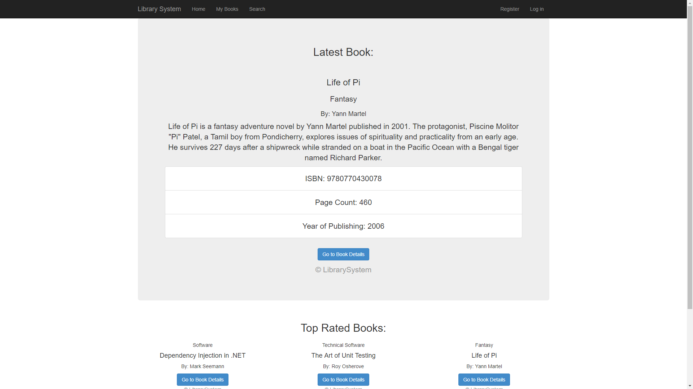
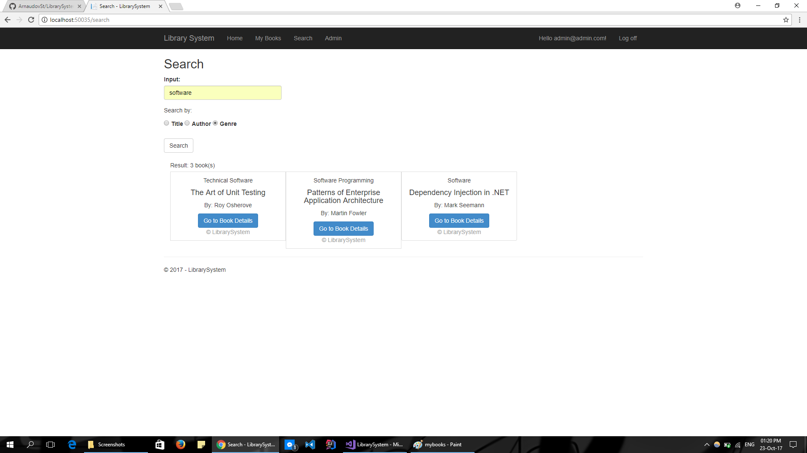
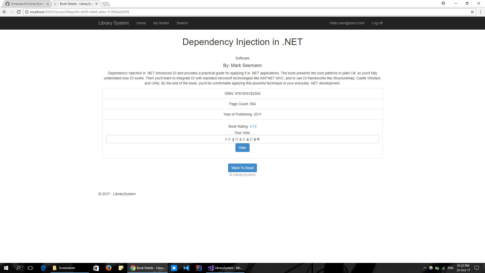
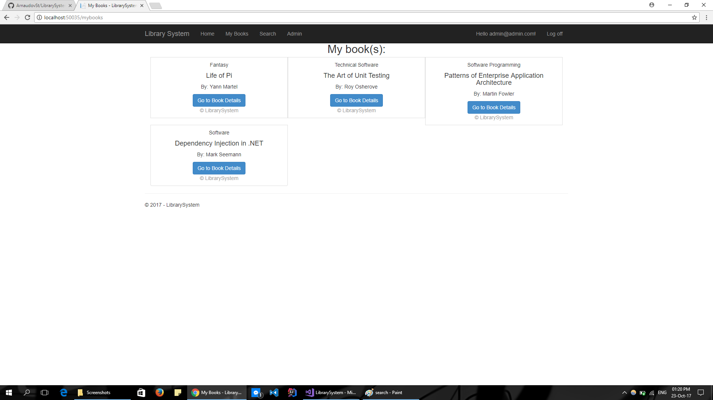
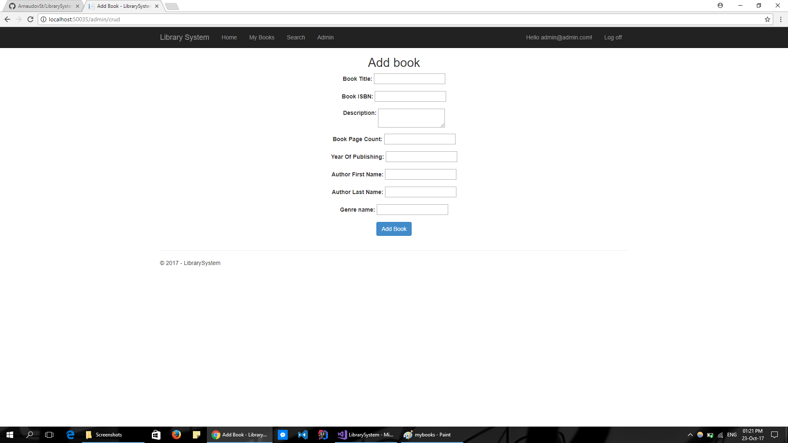

# LibrarySystem

## Library system is a student project for MVC course in Telerik Academy. You can search for books, rate them add them in your Want to Read collection. There is an admin functionality where the admin can add new Book with Author and Genre.

### Public part
  - Home
    - Details of the last added book
    - List of the books with highest rating
    
  - Search - by title, author or genre
    
    
#### Authenticated part
  - Book details with Rating functionality
    
  - User's book collection
    
    
#### Administration part
  - Admin page with Add book functionality
    
    
## Author

| Name        | Username     |
| -------------       | :--------:   |
| **Stefan Arnaudov** | [*Arnaudov_St*](http://telerikacademy.com/Users/Arnaudov_St)  |

## License

This project is licensed under the MIT License - see the [LICENSE](LICENSE) file for details
